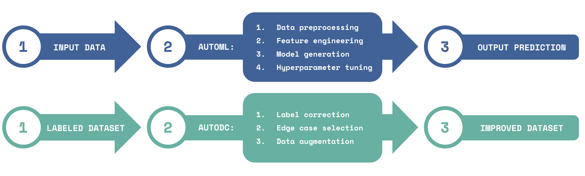

# AutoDC
## Automated data-centric processing

This repository is the official Python implementation of position paper "AutoDC: Automated data-centric processing". The implementation will continue being updated in the coming months.

AutoDC is a framework to enable domain experts to automatically and systematically improve datasets without much coding requirement and manual process, the idea similar with AutoML (automated machine learning). 

By using the AutoML system, such as Google Cloud AutoML, domain experts only need to bring in the input data, and AutoML takes care of the manual ML processes, then produces output predictions, along with user-defined evaluation metrics. With a similar idea, AutoDC is designed for domain experts to bring in a labeled dataset, such as annotated images, to the system; AutoDC takes care of the manual data improvement processes, and produces the improved dataset, by automatically correcting the incorrect labels (with user feedbacks), detecting edge cases, and augmenting edge cases.

## Citation

Zac Yung-Chun Liu, Shoumik Roychowdhury, Scott Tarlow, Akash Nair, Shweta Badhe, and Tejas Shah. AutoDC: Automated data-centric processing, NeurIPS 2021: DCAI workshop, [arXiv: 2111.12548](https://arxiv.org/abs/2111.12548).
